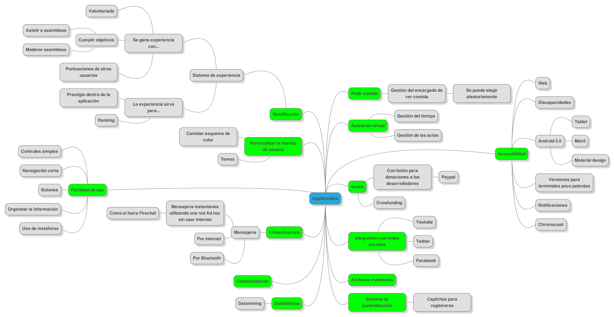

Appsamblea consiste en el desarrollo e implementación de un sistema software interactivo el cual utiliza tecnologías basadas en la nube y Android para ofrecer a sus usuarios un servicio de gestión de asambleas. Las funcionalidades que ofrecerá el sistema serán, entre otras:
- La posibilidad de crear una asamblea.
- Invitar y notificar a sus asistentes. 
- Establecer un tiempo de turno de palabra.
- Gestionar las votaciones.
- Determinar el sitio donde tendrá lugar la reunión.
- Establecer responsables de distintas actividades como, por ejemplo, llevar la comida.
- Personalizar la interfaz de usuario.
- Sistema de gamificación.
- Interacción con las redes sociales.
- Sistema de mensajería interno.
- Sistema de estadísticas.
- Accesibilidad para discapacitados.

Este mapa mental es un primer esbozo de lo que va a incluir la aplicación:

El desarrollo del proyecto seguirá un enfoque centrado en el usuario y en metodologías de desarrollo ágil para así garantizar la posibilidad de añadir las nuevas funcionalidades que vayan apareciendo durante las distintas fases de desarrollo sin que supongan un problema inabordable para los desarrolladores.
